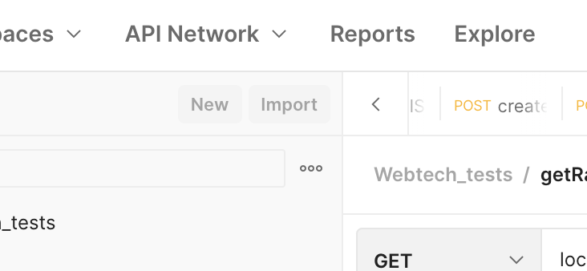

# WebTec_Steam

Pieper Marvin 1480547
Wesche Jan Pierre 1583926
Hinkelmanns Erik 1583861
Seliger Luca 1583243

## Testen
Zuerst müssen sie die Webtech_test.postman_collection.json in Postman importieren

Die Endung der

HTML,CSS,javascript [Marvin]

Wireframe [Luca,Marvin,Erik]

Entwurf [Luca,Erik]

URI-Template [Luca,Marvin,Erik]

SerienResource [Luca,Marvin,Erik]

Anfragen_Antworten.txt [Luca,Erik]

Serie_Entwurf [Luca]

SeriesSearch [Luca,Marvin]

SeriesReposetory 
-SearchSeries [Luca,Marvin]
-getSeriesWithID [Marvin]

run.bash [Marvin] ;)

